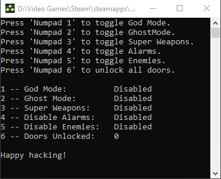

# Splinter Cell Chaos Theory Trainer
### Timeline
- Project started: 03/12/2021
- First release: 03/14/2021 
- Final Revision: 05/14/2021

## Overview & Demonstration
The main purpose of this project was to get familiar with the C language while also  
familiarizing myself with cross platform compilation from Linux (wsl Ubuntu 20.04 LTS)  
to Windows*.  

  
Godmode Enabled - The player can not receive damage of any kind (invincible) while  
enemies convert any and all damage taken to maximum damage. (insta-kill)

## Table of Contents
- [What I Learned](#what-i-learned)
- [How it works](#how-it-works)
- [Build Instructions](#build-instructions)
    - [Windows](#windows)
    - [Linux (Debian)](#building-in-linux)
- [Known issues](#known-issues)
- [Goals](#Goals)

### What I Learned
<b>Visual C++ lets you get away with a lot of programming fuckery.</b>

Switching to converting the old Visual C/C++ code to C99 was a pain because of the amount of  
errors that Visual Studio handled silently on its own. It was an enlightening experience.

While cross compiling from Linux to Windows using <code>i686-win64-mingw32-gcc</code> isn't as well  
documented as VisualC++ is, it is certainly doable (with serious effort). It took a bit of  
research just to get the compiler to compile all of the various non-standard 'MS-isms' that  
are included in <code>Windows.h</code> and <code>tlhelp32.h</code>.

I originally planned to hook DirectX for an internally hooked GUI, but getting mingw's ld  
to recognize <code>detours.h</code> was more work that it was really worth so it was abandoned.  
It seems that C++ is much better suited for these types of tasks anyway.

### How it works
Use any DLL injector that you are comfortable with to inject the file into the <code>splintercell3.exe</code> process.  
If you don't have a DLL injector, you can use mine <a href="https://github.com/malikrbooker/Vipers-DLL-Injector-2/releases/latest">here</a>.  

A resize-able console will pop up letting you know what hacks are available as well as their respective status.


## Build Instructions
### Windows
- Powershell
    1. install MinGW
    2. add MinGW/bin to path
    ```
    $ make.exe
    ```

- CMake
    1. install cmake for windows
    - Visual Studio 2019
        1. open the project folder in Visual Studio 2019
        2. ctrl + shift + b
    - Powershell
        1. open Powershell in project directory
        ```
        $ cmake -G "Visual Studio 2019" -A Win32 -B "build"
        $ cmake --build "build" --config "Release"
        ```

- WSL
    ```
    $ sudo apt install mingw-w64
    $ make
    ```

- Python
    ```
    python3 build.py
    ```

### Linux
- MinGW
    ```
    $ sudo apt install mingw-w64
    $ make
    ```

### Known issues
~~I could not find a reliable 'in game' boolean value or other explicit distinction that would  
prevent the user from attempting to execute the code in places that would crash the game.~~ <i>circumvented</i>

These locations include:
- ~~Special cases such as trying to teleport without first equipping weapon~~ <i>(patched May 05, 2021)</i>
- ~~Special cases such as trying to toggle no recoil without first equipping weapon~~ <i>(patched May 05, 2021)</i>

The entity list is also extremely illusive. Sometimes functions that include the EntityList Object end 
up returning NULL due to its random nature. The hacks that rely on the EntityList Object tend to work  
less reliably as multiple levels are completed.

### Goals
 - [x] Find reliable weapon pointer <i>(patched March 12, 2021)</i>
 - [x] ~~Find 'Death' __thiscall~~ <i>(removed - unnecessary)</i>
 - [x] Find a way to prevent PolterGheist from breaking the game <i>(patched May 5, 2021)</i>
 - [ ] Find reliable entity_list pointer
 - [ ] ~~Find reliable player_health pointer~~ <i>(removed - unnecessary)</i>
 - [ ] ~~Find reliable 'in game' boolean (or other explicit distinction)~~ <i>(removed - unnecessary)</i>

#### References
*Windows - <i>10 Pro Insider Preview Build 21318.rs_prerelease.210216-1530)</i>